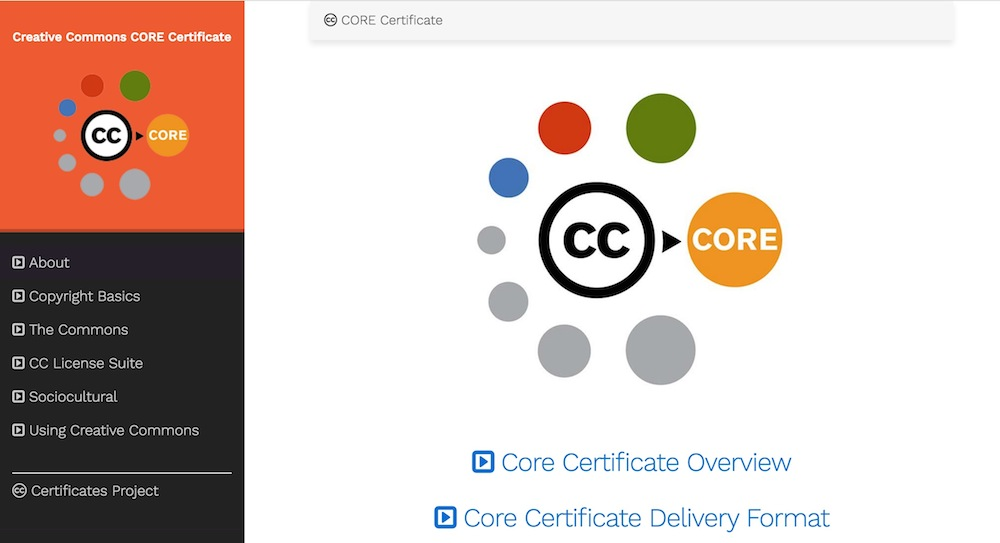

# CC Core Certificate a la Hugo

This repo contains the full structure and content for a version of the [Creative Commons Core Certificate](http://certificates.creativecommons.org/core) published via the static web site generator [Hugo](https://gohugo.io/) using the [Hugo Learn Theme](https://matcornic.github.io/hugo-learn-doc/). 

Source Markdown is derived from http://github.com/creativecommons/cc-cert-core in the same file structure found inside the `content` directory and published content inside `docs` available at https://github.com/creativecommons/cc-cert-hugo-core

Alternative versions can be created by forking this repository, editing content, and publishing in Hugo (suggested as it generates all navigation automagically.) but also the static HTML site can be used on any web site as is.
